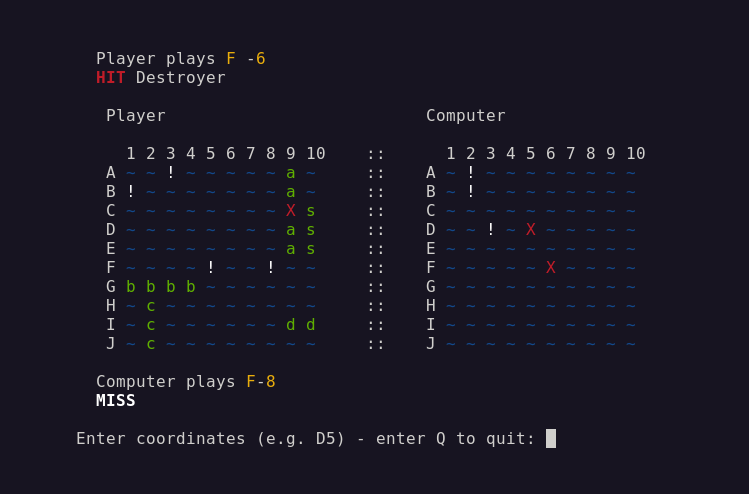
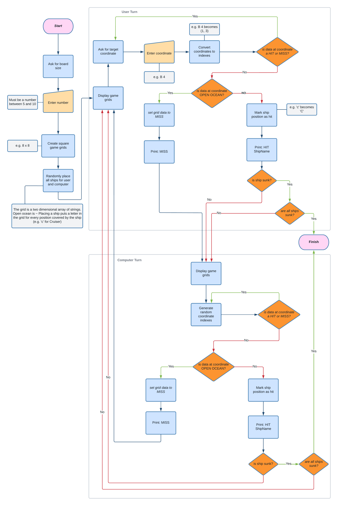
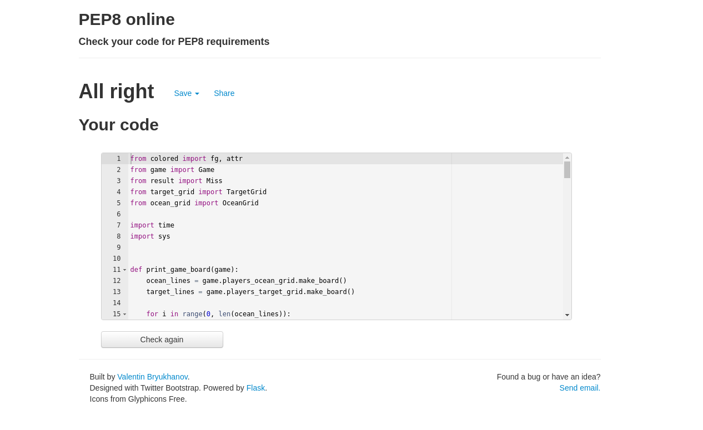

# Project 3 - Battleship game
***A terminal base Battleship game written in Python.***

&nbsp;

Site URL:

Repository for the project: https://github.com/dmcginley/Project3-python-game

Live website: https://project3-python-game.herokuapp.com/

## About the Project

The Battleship game was developed as a one player game, (one player vs the computer).

It is a version of the classic board game Battleship from Milton Bradley.

The game is deployed on Heroku and is terminal-based for user interaction.

## Table of contents

&nbsp;

## Wireframe

- landscape not portrait

## Who is this website for

- For casual gamers

## User Stories

&nbsp;

**Top Level Feature:**

*"As a user, I want to be able to play a Battleship game in 	the terminal like the old style game where I can call out
the coordinates link 'B1' to try and hit a ship."*

Acceptance criteria:

- Chart terminal based game.
- Use a coordinates method from 1 to 10, and a to j .

&nbsp;

&nbsp;

*"As a user, I want to be able to set the grid size,
so that I can choose to play a short or a long game"*

Acceptance criteria:

- Prompt the user for a grid size between 5 and 10
- Show error and ask again if the number given is not between 5 and 10
- Create a game grid as given, and display game grids side by side with proper alignment

&nbsp;

*"As a user, I would like a clear message to tell me whether a ship has been hit or missed, so I can see what action has
occurred.*

Acceptance criteria:

- Print a message to give clear feedback to user.
- If it is a miss, print MISS.
- If it is a hit, print HIT and the name of the ship.
- if a hit is the last hit on the ship, also print "You sunk my ship" giving the ship name.

&nbsp;

*"As a user, I want color on the board so I can quickly see what has happened so that the game gives quicker visual feedback."*

Acceptance criteria: 

- Add color to different events on the grid.
- Have 'Hit' show as red, and 'Miss' show as white in color.
- The ocean grid should be blue.

&nbsp;

*"As a user, I want different character to distinguish between hitting a boat and hitting water, so I can see where I hit on the board, even if the terminal does not support color output."* 

Acceptance criteria:

- Use 'X' character for hit, and '!' character for miss.

&nbsp;

*"As a user, I want an error message if I enter the wrong coordinates, such as: A4B or B22, so that I can see I if I mistyped the coordinates."*

Acceptance criteria: 

- Give an error message back if the user inputs coordinates outside the given parameter. 
- Explain the specific error, if possible e.g. the first coordinate should be a letter.
- Also prompted correct coordinates by giving an example e.g. D 4.

&nbsp;

*"As a user, I want the game to randomly place ships for me and the computer player,
so that I can start playing straight away."*

Acceptance criteria:

- All 5 ships should be randomly placed on each player's grid.
- No ship should go off the edge of the board.
- No ship should overlap with any other ship.

&nbsp;

*"As a user, I want the game to tell me when the game is over
so that I can quickly see who has won."*

Acceptance criteria:

- After each turn, check if the opponent has had every ship in their fleet sunk.
- If the computer has had all ships sunk, print "You win", and exit the game.
- In the opposite case, print "Computer Wins", and exit the game.

&nbsp;

- *"As a user, error message if I miss the board
- *"As a user, error message if I enter the wrong coordinates

&nbsp;

## Technologies Used

- **PyCharm** - IDE for Python
- **GitHub**
- **Heroku**

### The Code

- **Python3**

### Libraries used

- [colored 1.4.3](https://pypi.org/project/colored/) ~ Simple library for color and formatting to the terminal.

## General Game-play Layout

######  *Game play from the users perspective*

## Features

- Ships are represented by their leter:

	- **a** - Aircraft Carrier   
	- **b** - Battleship        
	- **c** - Cruiser         
	- **s** - Submarine  
	- **d** - Destroyer 

- Ability to place ships randomly for player and computer.
	- Collision detection so neither I nor the computer can place a ship on top of another.
	- Edge detection so that you cant place a ship over the edge of the boundary.
- Can set board size from 5 x 5 up to 10 x 10 - smaller board leads to a quicker game.
- Try to hit a ship by giving coordinates like: A 3.
- Shows whether you hit a ship or not by displaying a X or exclamation mark (!) on the grid.
- Print out the result of the player's move or of the computer's move, e.g. "D 3 - Miss!", or "D 4 - Hit! You sunk my Battleship"
- Correctly detect game over.

## Files & classes

There are 7 files:

- **ship.py** ~ *the ships properties*
	- class Ship

- **placement_result.py** ~ *object to tell if ships could be placed, or if there is a collision*
	- class PlacementResult
	- class NoOverlap
	- class Overlap

- **ocean_grid.py** ~ *where the ships are placed for each player, this is the grid that lies flat on the table in the original board game*
	- class OceanGrid

- **target_grid.py** ~ *a player's view of their opponent's positions, this is the vertical grid in the board game*
	- class TargetGrid

- **result.py** ~ *the outcome of a hit or miss*
	- class Result
	- class Miss
	- class Hit

- **game.py** ~ *keeps track of all four grids in the game, and handles hits and misses on the grids*
	- class Game:

- **run.py** ~ *handles the game logic of user turns*

## Color Choices
I chose universally understood colors for each element on the board:

- The Sea is blue
- The ships are green
- A Hit is red
- A Miss is white

## Accessibility

As well as colors the different elements of the game have different characters used, so the player isn't relaying on just color to view the different outcomes on the board, (e.g. ~X!).

Text is also printed out with every move to give a clear feedback to the player.

## Testing

*All tested in the terminal and also on Heroku.*

### Validator Testing

- [**pep8online**](http://pep8online.com/) - All 7 files passed (All right) with no errors.

### Manual Testing

*...and how I went about it.*

- Created one ship on a 4 x 4 board, knowing where it is on the board, hit the ship to return a HIT as expected. 
- Played through the game at each stage of the development process.
- I entered bad coordinates to check that it failed as expected.
- Once the game was finished I played through the game several times to check that either I won or the computer won.

## Error Handling

- Grid size asks again if less than 5 or greater that 10.
- prompt again if hit repeated space.
- gives error if entering e.g. 3c instead of c3.
- gives error if entering position off the grid. 

## Troubleshooting
- I found the game would sometimes crash when trying to find a ship. This was because I assumed any space that was not a ~ was a ship, which did not include ! for a miss. This also sometimes happened when I had hit a space already, so the code was trying to find a ship with letter 'A' instead of 'a'.  I fixed both of these by not allowing the user to attack a space twice, that is checking for ! or a capital letter before calling the shot.
- Sometimes it would look like it was targeting the wrong coordinates. I would enter A-1 and it would attack A-5. This is because it read it as "A" and -1, so the row[-1] would give the last position. I fixed this by removing any character from input that is not alphanumeric.
- There was a display problem when lining up the two grids side by side. For a 10 x 10 grid, the header "10" left the alignment of the second grid off by one space. I fixed this by checking if it was a 10 x 10 grid in the output method, and adding a single space at the end.

## Deployment

Deployed using [Heroku](https://www.heroku.com)

- Created an app (project3-python-game) on the Heroku site
- Installed Heroku in the terminal 
- Run the command: heroku login -i
- login with my username & password
- Then run the following command: heroku git:remote -a project3-python-game
- In pycharm terminal enter: git push heroku main
- Every time I need to redeploy I just run the last step: git push heroku main

Once everything compiled & ran correctly I checked everything was working okay. I made sure that I could enter text, and that the colors displayed correctly in the terminal in Heroku.

My **Battleship** game can be found here - https://project3-python-game.herokuapp.com/ *(same link as above)*.

## Version Control
The version control is done using Git through [GitHub](https://github.com).

The link to the project is https://github.com/dmcginley/Project3-python-game

#### HOW TO CLONE THE PROJECT

1. From the repository https://github.com/dmcginley/Project3-python-game navigate to **Code** and in the dropdown menu select the url: (https://github.com/dmcginley/Project3-python-game.git).

2. Open a Terminal on your computer.
3. Type **git clone**, and then paste the URL you copied earlier.
4. Press Enter to create your local clone.

## Resources

*General reading and resources.*

- [Python 3.10.4 documentation](https://docs.python.org/3/)
- [Real Python (realpython.com)](https://realpython.com/documenting-python-code/#basics-of-commenting-code)
#### The Game
- [Battleship Rule Book PDF](https://www.hasbro.com/common/instruct/battleship.pdf)

#### Books

- [Python Basics ~ *by Fletcher Heisler, David Amos & Dan
  Bader*](https://www.goodreads.com/book/show/43448128-python-basics-dan-bader)

##### Videos

- [Python Tutorial ~ Python Full Course for Beginners](https://www.youtube.com/watch?v=_uQrJ0TkZlc&list=PLPZlbsSRAxIoVPwTVmNYjV5HPqc-L1ARg&index=3)

- [12 Beginner Python Projects ~ Coding Course](https://www.youtube.com/watch?v=8ext9G7xspg&list=PLPZlbsSRAxIoVPwTVmNYjV5HPqc-L1ARg&index=5)

- [Python for Beginners ~ Microsoft Developer](https://www.youtube.com/playlist?list=PLlrxD0HtieHhS8VzuMCfQD4uJ9yne1mE6)

- [More Python for Beginners ~ Microsoft Developer](https://www.youtube.com/playlist?list=PLlrxD0HtieHiXd-nEby-TMCoUNwhbLUnj)

- [100 Days of Code: The Complete Python Pro Bootcamp for 2022](https://www.udemy.com/course/100-days-of-code/)

## Credits

*Sites content, media, and help with implementing code from tutorials & online help.*

- [**colored** 1.4.3](https://pypi.org/project/colored/) ~ Simple library for color and formatting to terminal
- [Site for the **ascii art** for Battleship](https://patorjk.com/software/taag/#p=display&f=Graffiti&t=Type%20Something%20)
- [stack**overflow** - print one character at a time in Python](https://stackoverflow.com/questions/9246076/how-to-print-one-character-at-a-time-on-one-line)

#### Tutorials

- [Code Institute - *Defining Classes in
  Python*](https://learn.codeinstitute.net/courses/course-v1:CodeInstitute+CPP_06_20+2020_T1/courseware/272f493b4d57445fbd634e7ceca3a98c/c75ed529d8f14d5aa5f359281c76c834/)
- [Battleship! LESSON](https://iampeterkr.github.io/battleship/?utm_source=pocket_mylist) ~ Used as a way of thinking
  about the game
- [Making a Python Battleship Game With Source Code](https://pythondex.com/python-battleship-game?utm_source=pocket_mylist) ~
  Similarly used as reference

##### Videos

- [How to Code Battleship in Python - Single Player Game](https://www.youtube.com/watch?v=tF1WRCrd_HQ&list=PLPZlbsSRAxIoVPwTVmNYjV5HPqc-L1ARg&index=38)

- [Game Board with 2D Array / Processing + Python](https://www.youtube.com/watch?v=nsLTQj-l_18&list=PLPZlbsSRAxIoVPwTVmNYjV5HPqc-L1ARg&index=39)

